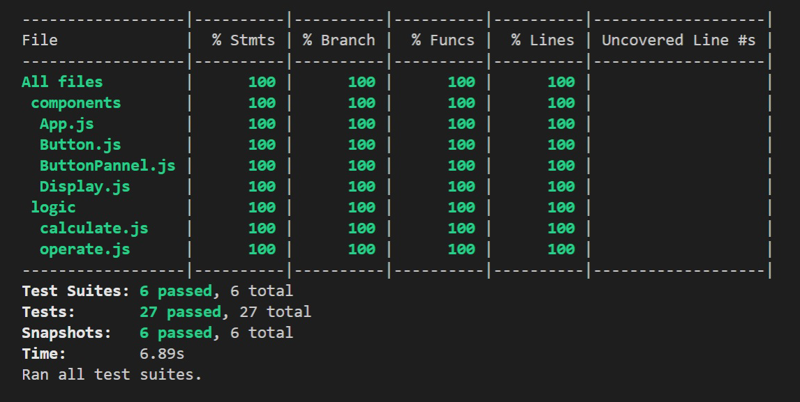

# react-calculator
Creating a simple calculator with React


## Table of Contents

* [Live Demo](#demo)
* [Installation](#installation)
* [Built With](#built-with)
* [tests](#tests)
* [Contributing](#contributing)
* [Acknowledgments](#acknowledgments)
* [Authors](#author)
* [License](#license)


## Live Demo

[Live Demo](https://ceci-calculator.netlify.app/)

## Installation

You can get a local copy of the repository please run the following commands on your terminal:
```
$ cd <folder>
$ git clone https://github.com/Ceci007/react-calculator.git
```

Run `npm install` and after `npm start` in your terminal.

## Built With
- React
- HTML
- CSS
- Heroku

## Tests

Run `npm test` to run all tests



## Contributing

Contributions, issues and feature requests are welcome!

You can do it on [issues page](https://github.com/Ceci007/react-calculator/issues).

## Acknowledgments

Special thanks to code reviewers.

## Show your support

Give a ⭐️ if you like this project!

## Author

👤 **Cecilia Benitez**

- [Github](https://github.com/Ceci007)
- [LinkedIn](https://www.linkedin.com/in/cecilia-benítez)

## 📝 License
This project is [MIT](lic.url) licensed.